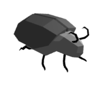
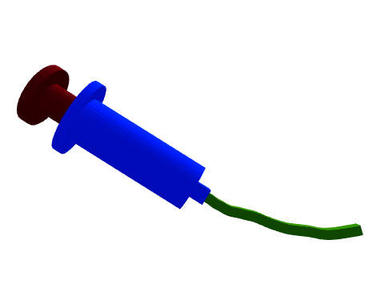
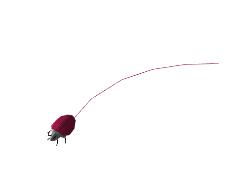
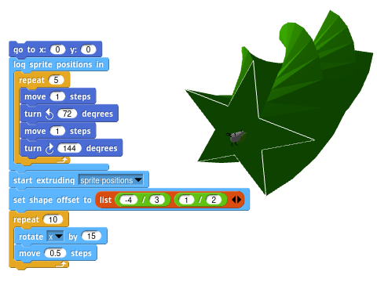
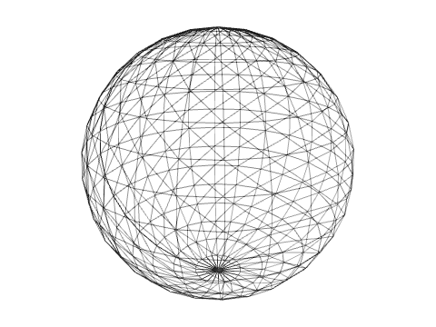
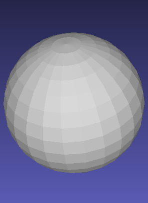
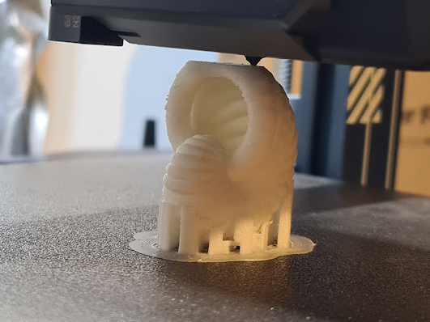

# 3D Beetle Extension

## A Tiny Bit of History

The 3D Beetle extension is heavily inspired in the [Beetle
Blocks](http://beetleblocks.com) Snap<em>!</em> mod, originally designed by Eric
Rosenbaum and Duks Koschitz and developed by Bernat Romagosa during the years
2014-2020.

Beetle Blocks was aimed at 3D fabrication, especially targeting 3D printing,
which is why the 3D Beetle extension also allows exporting the generated
geometry for 3D printing.

### If You Were a Beetle Blocks User

Then you should know that the biggest change you'll need to adjust to is that
there are **no shape primitives** in the 3D Beetle extension. All possible
geometry is generated by extrusion. The rest of the extension should feel very
natural for you, as all the other operations have been made to work pretty much
identically, and the coordinate system has also been preserved.

Additionally, the 3D Beetle extension provides a few extra operations and
features that you will easily adapt to.

You can refer to the [blocks reference](#all-blocks-described) at the end of
this article to learn what every single block does.

## Overview and Abstractions 

First of all, you will need to open the 3D viewport in order to be able to see
the Beetle and the geometries you generate. To do so, navigate to the *3D
Beetle* category and click on the button at the top of the blocks palette,
labeled *Open 3D Window*.

### The Beetle

The Beetle is a character that can move around in 3D space. Here's what it looks
like in its default color:

> 

This character is to 3D what the Lego turtle is to 2D. Turtles can move on a 2D
plane, but beetles can additionally fly and dig underground, which makes them
very apt at exploring the third dimension.

### Movement and Rotation

You can **move** and **rotate** the Beetle by using its particular movement and
rotation blocks. These work very much like the usual *Motion* blocks in
Snap<em>!</em>, but the extra Z axis makes things slightly more complicated.

> 

You can always look at the three axes of rotation -X (blue), Y (red) and Z
(green)- to determine what your rotation or movement operation will have the
beetle do.

### Extrusion

While moving, the Beetle is also able to generate 3D geometry by means of what
we call **extrusion**. Extruding is leaving a 3D trail along a path. Think of it
as if the Beetle was carrying a pastry tube, or one of these play dough
extruders, with interchangeable headers.

> 

Extrusion is the only way to generate geometry in the 3D beetle extension, but
it is a very powerful construct. As you gain experience with the extension
you'll find that all shapes can be constructed in terms of extrusions of 2D
profiles and polygons.

#### Extruding a Point

Extruding a single point will generate a line.

> 

The  block includes an option in the dropdown menu
for a point, centered right at the center of the beetle.

#### Extruding a Curve

Similarly, extruding a curve will generate a surface. A curve is any collection
of points in a 2D plane that don't define a closed polygon.

> 

The  block includes default options in the
dropdown menu for two different curves: semicircle and line. If you want to
extrude a different curve, you can always pass a different collection of 2D
points to the block:

> 

#### Extruding a Polygon

When extruding a polygon, the Beetle will generate a new prism at each movement
step, with its base shaped as said polygon and with the end cap matching the
current beetle rotation.

> 

The  block includes default options in the
dropdown menu for three different polygons: circle, triangle and square. If you
want to extrude a different polygon, you can always pass a different collection
of 2D points to the block, but you need to make sure that the first and last
points are duplicated so that the Beetle knows you mean to extrude a closed
shape:

> 

#### Scale and Offset

Extrusion shapes can be scaled up or down by using the 
block. The scale is a multiplier that is applied to the dimensions of the
current extrusion shape.

> 

Note that, as is often the case in Snap<em>!</em>, you can drop a list into the
scale block to get it to affect the width and height of the shape separately.

> 

Another operation you can apply to the current extrusion shape is an offset.
This will affect the position of the extrusion shape relative to the Beetle.

> 

#### Complex Extrusion Bases

Many shapes can be thought of in terms of combinations of the basic extrusion
shapes and their possible scaling and offsetting transformations. Others can
relatively easily be expressed as a list of points. Sometimes, though, your
extrusion base may be too complex to input manually into a list.

In these cases you'll want to use the `log sprite positions` block to trace the
path followed by a Snap<em>!</em> sprite and turn into an extrusion base.

> 

#### Arbitrary Extrusion Base Transformations

All extrusion shapes are just lists of points, which are in turn just lists of
two numbers. Here's the list of points of the default triangle extrusion:

Thus, you can apply any transformations you wish to the shape as you would with
any other list in Snap<em>!</em>. For instance, you could apply a `ceiling`
operation to the triangle shape to turn it into a right triangle:

> 

#### Zero-step Extrusion

A very powerful construct in the 3D Beetle extension is the zero-step extrusion.
When you ask the beetle to move zero steps while extruding, it will generate a
face in 3D space. This in itself may not sound too useful, but in combination
with rotation and scaling it can produce incredibly complex results. For
instance, here's how to generate a smooth corner by performing a series of turns
with zero-step extrusions in between:

> 

In the examples section you'll see zero-step extrusion used extensively to
generate a wide variety of shapes, such as revolution solids.

## Examples

### Basic Solids

Since the only way to generate volumes with the Beetle is to extrude 2D shapes
along a path, it can be interesting to start by taking a look at how to generate
a bunch of basic solids.

An important block that you may want to have at hand is . This
block will remove all geometry from the 3D view, and get the Beetle back to its
original position.

#### Cube

A cube can be understood as an extrusion of a square. Let's begin by selecting
the correct extrusion base from the dropdown menu in the following block:

You'll notice that the Beetle is now showing that shape around its body.

> 

From this point on, any movement you ask it to perform is going to leave a
square trail behind it. To get it to generate a cube, you just need to ask it to
walk one single step:

> 

#### Cylinder

Similarly, extruding a circle will produce a cylinder.

> 

#### Tube

Here's where things can begin to get a little bit tricky. If you want the
cylinder to have no caps -that is, if you want to generate a tube-, you can't
rely on a simple prism extrusion. The base shape would need to be a circle with
a smaller circular hole in the middle, which is not permitted.

One way to achieve a tube is to extrude a line around a circular path, thus
generating the walls of the cylinder one by one as the beetle walks in a circle:

> 

> 

To change the height of the tube you could specify a custom line to extrude:

> 

Or you could simply change the scale of the shape:

> 

If you want the tube to be centered on the beetle, you can do so by offsetting
the shape and performing a series of zero-step extrusions.

> 

Notice how you'll need to add an extra zero-step extrusion after the loop in
order to close the cylinder.

#### Tube with Thick Walls

The previous tube has walls of zero thickness. An easy way to achieve a thick
wall is to extrude a custom rectangle along a circular path:

> 

Notice how the tube presents a little glitch. The last extrusion step didn't
quite close the walls as you may have expected. That is because the extrusion
step is performed when the beetle moves, and the beetle moved before the last
15º rotation, when it happened to end up at the same spot and rotation it
started from.

One simple solution is to perform an extra extrusion by asking the beetle to
move zero steps after the loop:

> 

An even easier way to generate a tube with thick walls is to scale a square
non-uniformly. The _x_ scale will define the thickness of the walls, while the
_y_ scale will define the height of the tube.

> 

As is very often the case, there are multiple ways to think of a shape. You
could also generate a tube by extruding two semiannuli (yes, that's the word
mathematicians use for half a ring). You can first experiment with drawing the
semiannulus in turtle geometry in Snap<em>!</em>, which will _definitely_ be
much easier if you first load the Arcs library from the Library Browser.

> 

You can now turn that shape into an extrusion base by wrapping the script in a
`log sprite positions` block:

> 

Notice how this created a huge base. A single step for a Snap<em>!</em> sprite
becomes a millimeter in the Beetle world, and beetles are tiny critters. This
also helps increase the precision of your shapes. In this case, though, you can
apply a scale multiplier to bring the size down.

The only thing missing now is to extrude this shape twice while rotating it in
between.

> 

This is obviously too much of a hassle if all you wanted is to generate a tube,
but it opens the door to a completely different set of shapes that wouldn't be
possible with a rectangular-based tube extrusion, such as this thimble:

> 

Or this smoothly bent tube:

> 

#### Sphere

Extruding with zero-movement steps lets you generate revolution solids rather
easily.

For example, revolving around a center point while extruding a circle will
generate a sphere.

> 

However, the internal geometry of this sphere is a bit wrong. The Beetle
extension does its best to guess what you meant, but some 3D experts will frown
upon this sphere. Some of the facets are facing inside-out, and there is also an
internal circular face that is certainly not needed, since it'll never see the
light of day.

Both the wireframe and ghost mode toggles can help you visualize what your
geometry really looks like.

> 

Most 3D software will take this sphere without flinching, but others will
complain that the geometry is not correct and show it to you like it really is:

> 

#### Sphere with Proper Geometry

If your 3D software complains, then the "proper" way to make a sphere is to
revolve an open semicircle so that only the outer shell is generated, and with
its facets always facing the correct way.

> 

The geometry now looks perfectly fine in wireframe mode.

> 

Additionally, all 3D software renders it properly with no complaints about
reverse facets or internal faces.

> 

#### Cone

A cone can be understood as a revolution of a triangle. You could, thus, extrude
a triangle while turning around the Z axis and moving zero steps at each
rotation.

> 

However, similarly to what happened with the sphere example, the resulting shape
will be frowned upon by some 3D software:

> 

Just like before, the culprits are some of the faces that have ended up
inside-out.

#### Cone with Proper Geometry

To get a proper cone we will have to revolve two lines forming an acute angle.

> 

This can be easily achieved by passing in a list of three points that describe
an acute angle to the  block. This will also let
us change the radius and height of the cone rather easily.

> 

A different way to think of a cone is as a circular extrusion that scales down
into a point while being extruded.

The 3D Beetle extension provides a block that lets you change the scale of the
extrusion base, as well as the scale of the movement of the beetle.

To make a cone, you can start by extruding a 0-step circle, then setting the
shape scale to zero, then moving as many steps as deep you want your cone to be.

> 

### Advanced Examples

#### Pine Tree

A simple pine tree can be generated by revolving a 2D zigzag pattern. You can
use the already familiar `log sprite positions` block to get a list of points
that follow said zigzag pattern.

> 

A similar tree can be generated by extruding a succession of smaller and smaller
rather flat cones. This method will also allow you to tweak the color of each
floor independently.

> 

#### Staired Pyramid

A pyramid can also be thought of in different ways. An obvious one is to stack a
bunch of flat square boxes one on top of the other in decreasing sizes.

> 

To achieve this in the 3D Beetle extension you can again make use of the shape
scale.

> 

Notice how, for each floor, you first need to create a zero-length extrusion.
Otherwise, your pyramid would lack any stairs.

Another way to think of a pyramid is as a four-stepped revolution of a
stairwell. For each corner, the Beetle needs to rotate 90º and set an extrusion
step by moving zero steps.

> 

Of course, listing all the points for the stairwell by hand is going to be a
very tedious job if you want the pyramid to have any more floors.

A rather cumbersome loop could do the trick, but there are more elegant ways to
generate the stairwell. This is where mixing the 3D world of the beetle and the
2D world of Snap<em>!</em> shines. We can just tell a sprite to walk in a stair
pattern using regular turtle geometry, and store the sprite position at each of
the steps.

For clarity, you could get the sprite to draw the stairwell on the stage so you
can see what the profile will look like. Notice how it's important to not close
the shape if you don't want to end up with unwanted internal faces, while it's
also important to add a horizontal line at the bottom if you want the pyramid to
have a bottom face.

> 

Now you don't need the pen code anymore. You can just wrap the movement code in
a `log sprite positions` block and start extruding that shape.  While you're at
it, you can scale it down else you end up with a real-sized pyramid!

> 

The same code from before will now generate a ten-story pyramid.

> 

#### Snail Shell

This is a classic example brought straight from Beetle Blocks. You begin by
making a torus, or a doughnut, with a circular extrusion.

> 

Wrapping the torus in another loop that rotates around another axis will create
a doubly looped shape. Note that this operation can get rather slow on some
browsers.

If you perform the secondary rotation on the y axis (up/down, or pitch) you will
end up with a sort of yarn ball.

> 

But performing the secondary rotation on the x axis
(clockwise/counter-clockwise, or roll) will yield a torus of toruses.

> 

If you now increase the scale of both movement and shape by a little factor
after each inner torus, you'll end up with a shape resembling a snail shell.

> 

> 

Of course, nothing stops you from making it more pleasing to the eye by playing
a little bit with the pen color.

> 

## All Blocks Described

| | |
|--|--|
|  | Erases all 3D geometry and takes the Beetle back to its original position and orientation. It also erases the position and rotation stack (see push/pop position blocks). It does keep the current Beetle color. |
|  | Takes the Beetle back to its original position and orientation. |
| | &nbsp; |
|  | Moves the Beetle the specified number of steps forward. A Beetle step equals one millimeter. Beetles are small! |
| | &nbsp; |
|  | Moves the Beetle to an exact position in 3D space. Takes a 3-element list in the form `(x y z)` as an input. |
|  | Sets the Beetle's position in the specified axis, relative to the origin, to the specified value. |
|  | Changes the Beetle's position in the specified axis, relative to the origin, by the specified amount. |
|  | Changes the Beetle's position in the specified axis, relative to its current position and rotation, by the specified amount. |
|  | Reports the Beetle's current absolute position (relative to the origin) in the specified axis. |
| | &nbsp; |
|  | Rotates the Beetle around the specified axis by the specified amount of degrees (0-360). |
|  | Sets the Beetle's rotation relative to the specified axis to the specified value. |
|  | Gets the Beetle to look straight towards a point in 3D space. Takes a 3-element list in the form `(x y z)` as an input. |
|  | Reports the Beetle's current rotation relative to the specified axis. |
| | &nbsp; |
|  | Starts leaving a trail in the specified shape. Also accepts a list of 2D points in the form `(( x1 y1 ) (x2 y2) (x3 y3) ... )` as a base shape, such that it describes a curve or closed polygon. The Beetle will consider the list to describe a closed polygon when the first and last points are the same. The `sprite positions` menu options needs to be used in conjunction with the `log sprite positions` block. |
|  | Stops leaving a trail. |
| | &nbsp; |
|  | Records all positions visited by a regular Snap<em>!</em> sprite while running the blocks inside so that they can be extruded later by the Beetle. To extrude the logged positions, select `sprite positions` from the dropdown menu in the `start extruding` block. |
| | &nbsp; |
|  | Returns a list of all points that make up the current extrusion base. |
| | &nbsp; |
|  | Offsets the extrusion center by amounts specified by the provided two-item list. The first item in the list represents the horizontal offset, and the second one represents the vertical offset. |
|  | Sets the scale (multiplier) of the extrusion trail section, or the scale of the Beetle's movements, depending on the selection, to the specified value. When *shape* is selected, if provided with a list of two numbers, the first one will affect the horizontal scale and the second one will affect the vertical scale of the shape. |
|  | Changes the scale (multiplier) of the extrusion trail section, or the scale of the Beetle's movements, depending on the selection, by the specified amount. When *shape* is selected, if provided with a list of two numbers, the first one will affect the horizontal scale and the second one will affect the vertical scale of the shape. |
|  | Reports the scale (multiplier) of the extrusion trail section, or the scale of the Beetle's movements, depending on the selection. |
| | &nbsp; |
|  | Stores the current Beetle position and rotation, so that it can be revisited later. |
|  | Takes the Beetle back to the last stored position and rotation. |
| | &nbsp; |
|  | Reports a picture of what the Beetle is seeing from its current position and rotation. |

